```r
## Set Chunk requirements
knitr::opts_chunk$set(echo = TRUE, message = FALSE, warning = FALSE)
#echo=FALSE indicates that the code will not be shown in the final document 
#(though any results/output would still be displayed).
#include=FALSE to have the chunk evaluated, but neither the code nor its output displayed
# warning=FALSE and message=FALSE suppress any R warnings or messages from being included 
#in the final document
```


```r
#Import relevant packages
library(stats)
library(psych)
library(ggplot2)
```


```r
#loading the excel dataset with two sheets
library("readxl")
setwd('E:/Documents/Reinp/GitHub Respositories/AB_Testing-with-RStudio')
ds_sd<-read_excel('School data.xlsx', sheet = "Data")
View(ds_sd)
attach(ds_sd)

ds_sd1<-read_excel('School data.xlsx', sheet = "District names")
View(ds_sd1)
attach(ds_sd1)
```


```r
#learn more about the dataset
help(ds_sd)
```

```
## No documentation for 'ds_sd' in specified packages and libraries:
## you could try '??ds_sd'
```

```r
??ds_sd
str(ds_sd)
```

```
## Classes 'tbl_df', 'tbl' and 'data.frame':	6984 obs. of  6 variables:
##  $ district_id             : num  78 78 78 78 78 78 78 78 78 78 ...
##  $ attended_male           : num  208 337 215 200 128 185 216 180 183 205 ...
##  $ attended_female         : num  205 281 162 167 137 140 168 130 159 161 ...
##  $ enrolled_male_students  : num  769 859 695 850 609 556 477 512 604 225 ...
##  $ enrolled_female_students: num  620 685 585 701 519 442 342 436 469 176 ...
##  $ treatment               : num  1 0 0 0 1 0 0 1 1 1 ...
```

```r
class(ds_sd)
```

```
## [1] "tbl_df"     "tbl"        "data.frame"
```

```r
typeof(ds_sd) 
```

```
## [1] "list"
```

```r
length(ds_sd)
```

```
## [1] 6
```

```r
names(ds_sd) #display variable names
```

```
## [1] "district_id"              "attended_male"           
## [3] "attended_female"          "enrolled_male_students"  
## [5] "enrolled_female_students" "treatment"
```

```r
#attributes(ds_sd) #names(ds_sd), class(ds_sd), row.names(ds_sd)
```


```r
#distribution of input variables
table(ds_sd$district_id)
```

```
## 
##   3   5   6  16  17  22  39  42  43  44  47  50  57  58  62  65  67  68  77  78 
## 253 279 256 302 218 227 274 225 248 237 222 241 294 251 239 290 260 243 260 270 
##  79  80  93  97 104 107 108 200 
## 319 288 245 247 233 254 295  14
```

```r
table(ds_sd1$"DISTRICT ID")
```

```
## 
##   1   2   3   5   6  16  17  22  39  42  43  44  47  50  57  58  62  65  67  68 
##   1   1   1   1   1   1   1   1   1   1   1   1   1   1   1   1   1   1   1   1 
##  77  78  79  80  93  97 104 107 108 112 
##   1   1   1   1   1   1   1   1   1   1
```


```r
#unique values per column
unique(ds_sd$district_id)
```

```
##  [1]  78  79   3  80  39   5   6  16  17  22  42  43  93  44  97  47  50  57  58
## [20]  62 104  65 107 108  67  68  77 200
```

```r
unique(ds_sd1$"DISTRICT ID")
```

```
##  [1]  78  79   3  80  39   5   6  16  17  22  42  43  93  44  97  47  50  57  58
## [20]  62 104  65 107 108  67  68  77 112   1   2
```


```r
#district_id 200 in (ds_sd dataframe) is not in the (ds-sd1 dataframe)
#DISTRICT ID 1 in (ds_sd1 dataframe) is not in the (ds-sd dataframe)
#DISTRICT ID 2 in (ds_sd1 dataframe) is not in the (ds-sd dataframe)
#DISTRICT ID 112 in (ds_sd1 dataframe) is not in the (ds-sd dataframe)
```


```r
ds_sdmerge <- merge(ds_sd, ds_sd1, by.x = "district_id", by.y = "DISTRICT ID") #N/A. 
#This is default #Keep rows where there’s a match in both #innerjoin
View(ds_sdmerge)

ds_sdmerge1 <- merge(ds_sd, ds_sd1, by.x = "district_id", by.y = "DISTRICT ID", all.x = TRUE)
#Keep all rows from x, regardless of match in y #leftJoin even if there's no match in y
View(ds_sdmerge1)

ds_sdmerge2 <- merge(ds_sd, ds_sd1, by.x = "district_id", by.y = "DISTRICT ID", all.y = TRUE)
#Keep all rows from y, regardless of match in x #Rightjoin even if there's no match in x
View(ds_sdmerge2)

ds_sdmerge3 <- merge(ds_sd, ds_sd1, by.x = "district_id", by.y = "DISTRICT ID", all= TRUE)
#Keep all rows from x AND from y #Outerjoin 
View(ds_sdmerge3)

#We select default merge for the final data. It keeps rows where there’s a match in both. 
#we get a total of 6970 schools
```


```r
#add total_enrolled column by computing the total number of student enrolled and total number 
#of attended in each school
#Get the total number of student enrolled in each school by adding enrolled_male_students 
#and enrolled_female_students columns

#Adding by equation
ds_sdmerge$total_enrolled=ds_sdmerge$enrolled_male_students + ds_sdmerge$enrolled_female_students
ds_sdmerge$total_attended=ds_sdmerge$attended_male + ds_sdmerge$attended_female

#transform() function
ds_sdmerge1 <- transform(ds_sdmerge1, total_enrolled = enrolled_male_students +
                    enrolled_female_students)
ds_sdmerge1 <- transform(ds_sdmerge1, total_attended = attended_male + attended_female)

#apply() function
ds_sdmerge2$total_enrolled <- apply(ds_sdmerge2[,c('enrolled_male_students',
                          'enrolled_female_students')], 1, function(x) sum(x))
ds_sdmerge2$total_attended <- apply(ds_sdmerge2[,c('attended_male', 'attended_female')], 1,
                              function(x) sum(x))

#tidyverse's dplyr
library(dplyr)
ds_sdmerge3 <- mutate(ds_sdmerge3, total_enrolled = enrolled_male_students +
                        enrolled_female_students)
ds_sdmerge3 <- mutate(ds_sdmerge3, total_attended = attended_male + attended_female)
```


```r
#summary statistics
summary(ds_sdmerge) #summarizes the dataset
```

```
##   district_id     attended_male   attended_female enrolled_male_students
##  Min.   :  3.00   Min.   :  0.0   Min.   :  0.0   Min.   :-999.0        
##  1st Qu.: 39.00   1st Qu.:190.0   1st Qu.:161.0   1st Qu.: 321.0        
##  Median : 58.00   Median :247.0   Median :207.0   Median : 479.0        
##  Mean   : 57.27   Mean   :253.3   Mean   :211.6   Mean   : 531.9        
##  3rd Qu.: 79.00   3rd Qu.:308.0   3rd Qu.:257.0   3rd Qu.: 730.0        
##  Max.   :108.00   Max.   :597.0   Max.   :483.0   Max.   :1194.0        
##  enrolled_female_students   treatment      District Name      total_enrolled   
##  Min.   :-999.0           Min.   :0.0000   Length:6970        Min.   :-1998.0  
##  1st Qu.: 268.0           1st Qu.:0.0000   Class :character   1st Qu.:  592.0  
##  Median : 394.0           Median :0.0000   Mode  :character   Median :  870.5  
##  Mean   : 438.7           Mean   :0.4973                      Mean   :  970.7  
##  3rd Qu.: 600.8           3rd Qu.:1.0000                      3rd Qu.: 1331.8  
##  Max.   : 991.0           Max.   :1.0000                      Max.   : 1999.0  
##  total_attended  
##  Min.   :   0.0  
##  1st Qu.: 353.0  
##  Median : 456.0  
##  Mean   : 464.9  
##  3rd Qu.: 564.0  
##  Max.   :1045.0
```

```r
describe(ds_sdmerge)
```

```
##                          vars    n   mean     sd median trimmed    mad   min
## district_id                 1 6970  57.27  31.22   58.0   57.68  29.65     3
## attended_male               2 6970 253.31  85.78  247.0  249.84  87.47     0
## attended_female             3 6970 211.62  70.68  207.0  208.50  71.16     0
## enrolled_male_students      4 6970 531.93 266.40  479.0  518.04 276.50  -999
## enrolled_female_students    5 6970 438.73 222.13  394.0  427.54 223.87  -999
## treatment                   6 6970   0.50   0.50    0.0    0.50   0.00     0
## District Name*              7 6970    NaN     NA     NA     NaN     NA   Inf
## total_enrolled              8 6970 970.66 485.92  870.5  946.60 496.67 -1998
## total_attended              9 6970 464.93 153.75  456.0  458.95 157.16     0
##                           max range  skew kurtosis   se
## district_id               108   105 -0.15    -0.92 0.37
## attended_male             597   597  0.39     0.09 1.03
## attended_female           483   483  0.42     0.13 0.85
## enrolled_male_students   1194  2193 -0.12     2.20 3.19
## enrolled_female_students  991  1990 -0.38     4.23 2.66
## treatment                   1     1  0.01    -2.00 0.01
## District Name*           -Inf  -Inf    NA       NA   NA
## total_enrolled           1999  3997 -0.26     3.07 5.82
## total_attended           1045  1045  0.36     0.03 1.84
```


```r
#Create the school_id variable by first sorting the data within each district by the total
#number of enrollees per school. Let the ID be 1 for the school within each district with the
#highest number of enrolled students, 2 for the second highest and so on........

ds_sdmerge <- arrange(ds_sdmerge,district_id,desc(total_enrolled))


ds_sdmerger <- ds_sdmerge %>% 
  group_by(district_id) %>% 
  mutate(school_id = rank(desc(total_enrolled), ties.method = "first"))

View(ds_sdmerger)
head(ds_sdmerger)
```

```
## # A tibble: 6 x 10
## # Groups:   district_id [1]
##   district_id attended_male attended_female enrolled_male_s~ enrolled_female~
##         <dbl>         <dbl>           <dbl>            <dbl>            <dbl>
## 1           3           212             177             1020              959
## 2           3           335             331              985              962
## 3           3           261             186             1139              807
## 4           3           208             166             1014              920
## 5           3           238             184             1050              881
## 6           3           112              75             1016              908
## # ... with 5 more variables: treatment <dbl>, `District Name` <chr>,
## #   total_enrolled <dbl>, total_attended <dbl>, school_id <int>
```

```r
tail(ds_sdmerger)
```

```
## # A tibble: 6 x 10
## # Groups:   district_id [1]
##   district_id attended_male attended_female enrolled_male_s~ enrolled_female~
##         <dbl>         <dbl>           <dbl>            <dbl>            <dbl>
## 1         108           118              97              136              110
## 2         108            73              55              126              106
## 3         108            66              64              112              108
## 4         108           242             230             -999             -999
## 5         108           156             162             -999             -999
## 6         108           239             222             -999             -999
## # ... with 5 more variables: treatment <dbl>, `District Name` <chr>,
## #   total_enrolled <dbl>, total_attended <dbl>, school_id <int>
```


```r
#Check the numeric variables for outliers.
describe(ds_sdmerger)
```

```
##                          vars    n   mean     sd median trimmed    mad   min
## district_id                 1 6970  57.27  31.22   58.0   57.68  29.65     3
## attended_male               2 6970 253.31  85.78  247.0  249.84  87.47     0
## attended_female             3 6970 211.62  70.68  207.0  208.50  71.16     0
## enrolled_male_students      4 6970 531.93 266.40  479.0  518.04 276.50  -999
## enrolled_female_students    5 6970 438.73 222.13  394.0  427.54 223.87  -999
## treatment                   6 6970   0.50   0.50    0.0    0.50   0.00     0
## District Name*              7 6970    NaN     NA     NA     NaN     NA   Inf
## total_enrolled              8 6970 970.66 485.92  870.5  946.60 496.67 -1998
## total_attended              9 6970 464.93 153.75  456.0  458.95 157.16     0
## school_id                  10 6970 130.90  76.85  130.0  129.61  96.37     1
##                           max range  skew kurtosis   se
## district_id               108   105 -0.15    -0.92 0.37
## attended_male             597   597  0.39     0.09 1.03
## attended_female           483   483  0.42     0.13 0.85
## enrolled_male_students   1194  2193 -0.12     2.20 3.19
## enrolled_female_students  991  1990 -0.38     4.23 2.66
## treatment                   1     1  0.01    -2.00 0.01
## District Name*           -Inf  -Inf    NA       NA   NA
## total_enrolled           1999  3997 -0.26     3.07 5.82
## total_attended           1045  1045  0.36     0.03 1.84
## school_id                 319   318  0.11    -1.04 0.92
```

```r
## We use boxplot to visualize for any outliers

boxplot(ds_sdmerger [, c("attended_male", "attended_female", "enrolled_male_students",
      "enrolled_female_students", "total_enrolled", "total_attended")], main="boxplots",
xlab="variables",
ylab="number of students",
col="orange",
border="brown", las = 2, cex.axis = 0.6, col.axis = 'blue', col.lab = 'red')
```

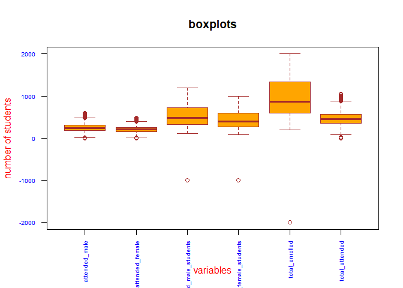<!-- -->


```r
#From the boxplot above, outliers are present in form of negative count of students.
#There are negative values in enrolled_male_students and in enrolled_female_students leading 
#to a negative total_enrolled
```


```r
#cleaning data from the outliers
ds_sdmerger1 <- ds_sdmerger[(ds_sdmerger[,8]>0),]
View(ds_sdmerger1)
describe(ds_sdmerger1)
```

```
##                          vars    n   mean     sd median trimmed    mad min  max
## district_id                 1 6948  57.27  31.22   58.0   57.67  29.65   3  108
## attended_male               2 6948 253.42  85.76  247.0  249.93  87.47   0  597
## attended_female             3 6948 211.71  70.67  207.0  208.57  71.16   0  483
## enrolled_male_students      4 6948 536.78 252.49  481.0  519.18 277.25 106 1194
## enrolled_female_students    5 6948 443.28 207.20  395.0  428.48 223.87  88  991
## treatment                   6 6948   0.50   0.50    0.0    0.50   0.00   0    1
## District Name*              7 6948    NaN     NA     NA     NaN     NA Inf -Inf
## total_enrolled              8 6948 980.06 457.02  873.5  948.68 495.93 204 1999
## total_attended              9 6948 465.13 153.72  456.0  459.11 157.16   0 1045
## school_id                  10 6948 130.49  76.62  129.0  129.21  94.89   1  319
##                          range  skew kurtosis   se
## district_id                105 -0.15    -0.92 0.37
## attended_male              597  0.40     0.08 1.03
## attended_female            483  0.42     0.12 0.85
## enrolled_male_students    1088  0.50    -0.86 3.03
## enrolled_female_students   903  0.52    -0.81 2.49
## treatment                    1  0.01    -2.00 0.01
## District Name*            -Inf    NA       NA   NA
## total_enrolled            1795  0.49    -0.90 5.48
## total_attended            1045  0.37     0.03 1.84
## school_id                  318  0.11    -1.04 0.92
```


```r
#Label values for the treatment variable appropriately (1 = Treatment, 0 = Control)
ds_sdmerger1$treatment_type <- factor(ds_sdmerger1$treatment, levels = c(0,1), 
                                      labels = c("control", "treatment"))
View(ds_sdmerger1)


which(is.na(ds_sdmerger1$total_attended)) #check for missing values
```

```
## integer(0)
```

```r
which(!complete.cases(ds_sdmerger1))
```

```
## integer(0)
```


```r
#Create a well labelled graphs showing the difference in attendance between treatment 
#and control schools.

bp1 <- barplot(tapply(ds_sdmerger1$attended_female, ds_sdmerger1$treatment_type, FUN=sum), 
    xlab="treatment_type",ylab="attended_female",col=c("lightblue", "green"), 
main="Sum Attended Female Barplot chart",border="brown" , col.axis = 'blue', col.lab = 'red',
cex.axis = 0.7, cex.lab = 0.8, las = 2, ylim=c(0, 800000))
text(bp1, 0, tapply(ds_sdmerger1$attended_female, ds_sdmerger1$treatment_type, FUN=sum), 
     cex=1,pos=3)
```

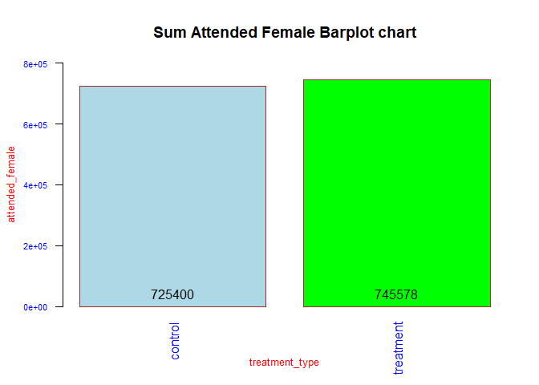<!-- -->

```r
bp2 <- barplot(tapply(ds_sdmerger1$attended_male, ds_sdmerger1$treatment_type, FUN=sum),
    xlab="treatment_type",ylab="attended_male",col=c("yellow", "orange"),
    main="Sum Attended Male Barplot chart",border="brown" , col.axis = 'blue', col.lab = 'red',
    cex.axis = 0.7, cex.lab = 0.8, las = 2, ylim=c(0, 1000000))
text(bp2, 0, tapply(ds_sdmerger1$attended_male, ds_sdmerger1$treatment_type, FUN=sum), 
     cex=1,pos=3)
```

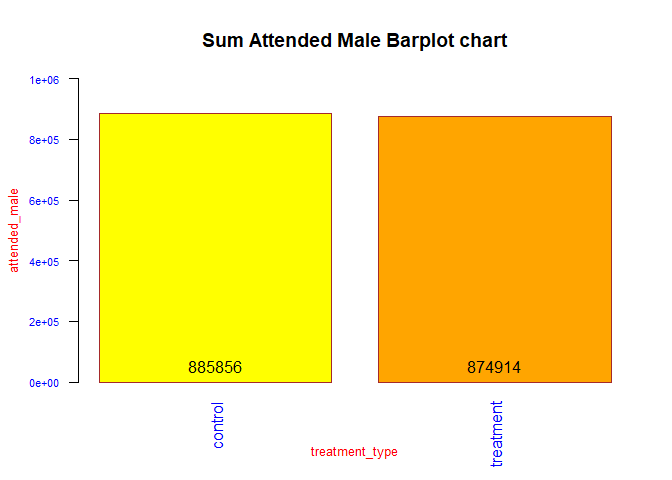<!-- -->

```r
bp3 <- barplot(tapply(ds_sdmerger1$total_attended, ds_sdmerger1$treatment_type, FUN=sum), 
      xlab="treatment_type",ylab="total_attended",col=c("grey", "purple"),
  main="Total Sum Attended Barplot chart",border="brown" , col.axis = 'blue', col.lab = 'red',
  cex.axis = 0.7, cex.lab = 0.8, las = 2, ylim=c(0, 2000000))
text(bp3, 0, tapply(ds_sdmerger1$total_attended, ds_sdmerger1$treatment_type, FUN=sum), 
     cex=1,pos=3)
```

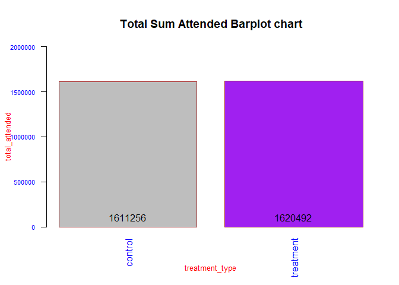<!-- -->


```r
#relationship between treatment_type and total_attended by means of a boxplot
boxplot(attended_female ~ treatment_type,
col=c("lightblue", "green"),ds_sdmerger1,
col.axis = 'blue', col.lab = 'red', border="brown",
main="Sum Attended Female BoxPlot")
```

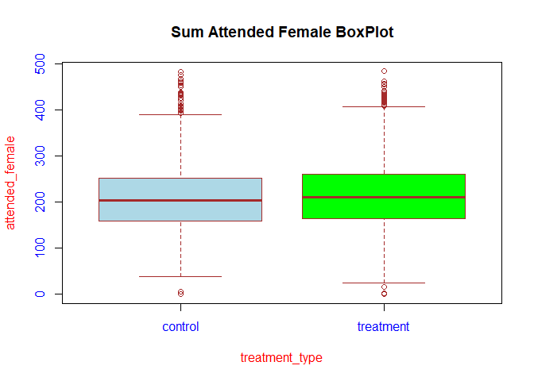<!-- -->

```r
boxplot(attended_male ~ treatment_type,
col=c("yellow", "orange"),ds_sdmerger1,
col.axis = 'blue', col.lab = 'red', border="brown",
main="Sum Attended Male BoxPlot")
```

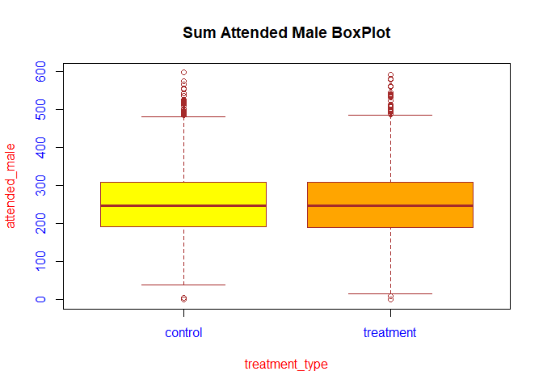<!-- -->

```r
boxplot(total_attended ~ treatment_type,
col=c("gray","purple"),ds_sdmerger1,
col.axis = 'blue', col.lab = 'red', border="brown",
main="Total Sum Attended BoxPlot")
```

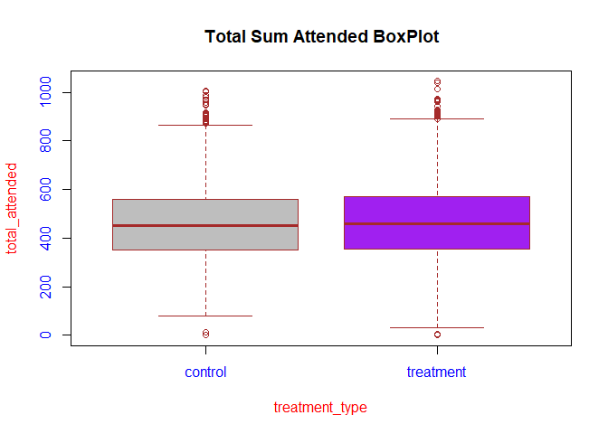<!-- -->


```r
#finding a fitting distribution for the total attended variable
library(car)
library(MASS) #So that distributions that must be non-zero can make sense of my data

qqp(ds_sdmerger1$total_attended+1, "norm", main="Normal model")
```

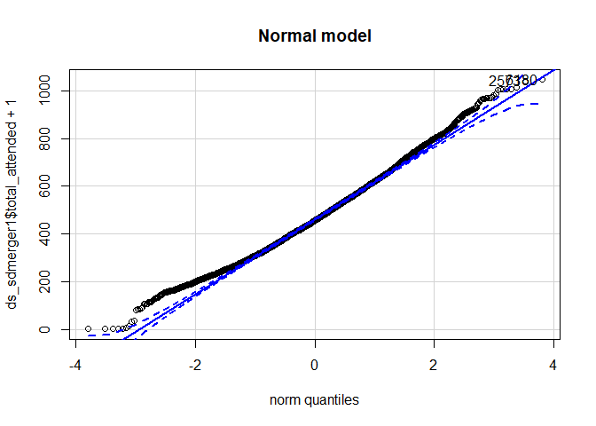<!-- -->

```
## [1] 6180 2573
```

```r
qqp(ds_sdmerger1$total_attended+1, "lnorm", main="LogNormal model") #lnorm means lognormal
```

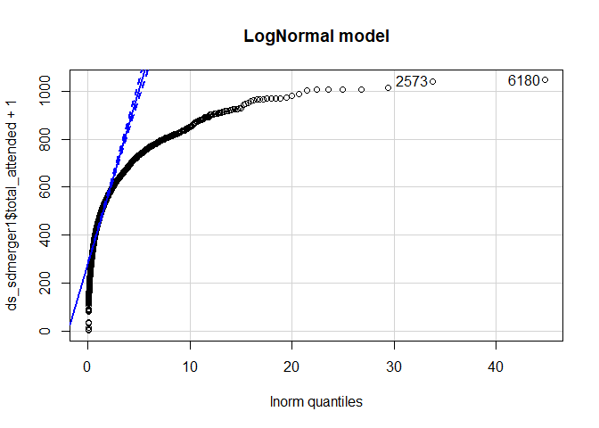<!-- -->

```
## [1] 6180 2573
```

```r
# qqp requires estimates of the parameters of the negative binomial, Poisson
# and gamma distributions. You can generate estimates using the fitdistr
# function.

#negative binomial and gamma distributions can only handle positive numbers.
#Poisson distribution can only handle positive whole numbers. 
#Binomial and Poisson distributions are different from the others because they 
#are discrete rather than continuous, which means they quantify distinct, 
#countable events or the probability of these events

nbinom <- fitdistr(ds_sdmerger1$total_attended+1, "Negative Binomial")
qqp(ds_sdmerger1$total_attended+1, "nbinom", size = nbinom$estimate[[1]], mu =
      nbinom$estimate[[2]], main="Negative Binomial model")
```

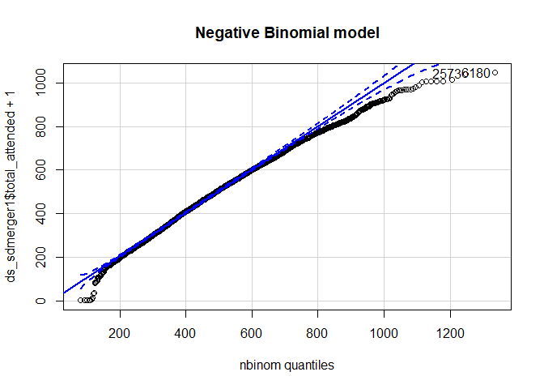<!-- -->

```
## [1] 6180 2573
```

```r
pois <- fitdistr(ds_sdmerger1$total_attended+1, "Poisson")
qqp(ds_sdmerger1$total_attended+1, "pois", lambda=pois$estimate, main="Poisson model")
```

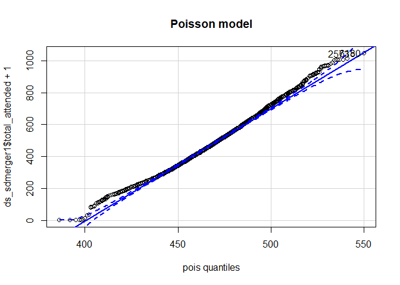<!-- -->

```
## [1] 6180 2573
```

```r
gamma <- fitdistr(ds_sdmerger1$total_attended+1, "gamma")
qqp(ds_sdmerger1$total_attended+1, "gamma", shape = gamma$estimate[[1]], rate =
      gamma$estimate[[2]], main="Gamma model")
```

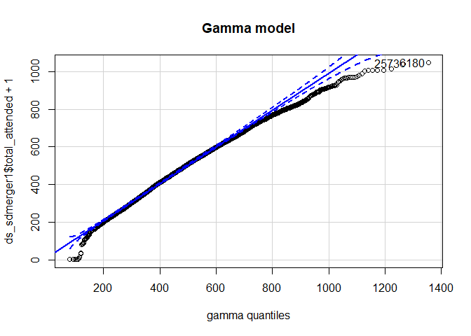<!-- -->

```
## [1] 6180 2573
```


```r
#Armed with the knowledge of which probability distribution fits best, 
#we can try fitting a model


#A mixed model is similar in many ways to a linear model. 
#It estimates the effects of one or more explanatory variables on a response variable.
#The output of a mixed model will give you a list of explanatory values, estimates and
#confidence intervals of their effect sizes, p-values for each effect, and 
#at least one measure of how well the model fits. 
#You should use a mixed model instead of a simple linear model when you have a variable 
#that describes your data sample as a subset of the data you could have collected.

#In a mixed model, we add one or more random effects to our fixed effects.
#These random effects essentially give structure to the error term. 
#this characterizes idiosyncratic variation that is due to individual differences.

#linear models are “fixed-effects-only” models. They have one or more fixed effects and a 
#general error term.

#If data is normally distributed, we can use a linear mixed model (LMM). 
#load the lme4 package and make a call to the function lmer. 
#The first argument to the function is a formula that takes the form y ~ x1 + x2 ...etc.,
#where y is the response variable and x1, x2, etc. are explanatory variables. 
#Random effects are added in with the explanatory variables. 
#Crossed random effects take the form (1 | r1) + (1 | r2) ... 
#while nested random effects take the form (1 | r1 / r2).

#The next argument is where you designate the data frame your variables come from. 
#This is where you can designate whether the mixed model will estimate the parameters
#using maximum likelihood or restricted maximum likelihood. 
#If your random effects are nested, or you have only one random effect, and if your data
#are balanced (i.e., similar sample sizes in each factor group) set REML to FALSE, 
#because you can use maximum likelihood. 
#If your random effects are crossed, don't set the REML argument because it defaults
#to TRUE anyway.
```


```r
library(lme4)
#1.We construct the null model first. 
#H0 (called the null hypothesis ): There is no relationship between the two variables.

lmmtreatment.null <- lmer(total_attended ~ total_enrolled + (1 | district_id), 
                          data = ds_sdmerger1, REML = FALSE)
summary(lmmtreatment.null)
```

```
## Linear mixed model fit by maximum likelihood  ['lmerMod']
## Formula: total_attended ~ total_enrolled + (1 | district_id)
##    Data: ds_sdmerger1
## 
##      AIC      BIC   logLik deviance df.resid 
##  88998.4  89025.8 -44495.2  88990.4     6944 
## 
## Scaled residuals: 
##     Min      1Q  Median      3Q     Max 
## -3.5915 -0.7191 -0.0497  0.6586  3.6938 
## 
## Random effects:
##  Groups      Name        Variance Std.Dev.
##  district_id (Intercept)  1797     42.39  
##  Residual                21121    145.33  
## Number of obs: 6948, groups:  district_id, 27
## 
## Fixed effects:
##                 Estimate Std. Error t value
## (Intercept)    4.103e+02  9.149e+00   44.84
## total_enrolled 5.773e-02  3.825e-03   15.09
## 
## Correlation of Fixed Effects:
##             (Intr)
## total_nrlld -0.410
```

```r
#The Anova function does a Wald test, which tells us how confident we are of our 
#estimate of the effect of total enrolled on total attended, and the p-value tells 
#me that I should not be confident at all.
Anova(lmmtreatment.null)
```

```
## Analysis of Deviance Table (Type II Wald chisquare tests)
## 
## Response: total_attended
##                 Chisq Df Pr(>Chisq)    
## total_enrolled 227.82  1  < 2.2e-16 ***
## ---
## Signif. codes:  0 '***' 0.001 '**' 0.01 '*' 0.05 '.' 0.1 ' ' 1
```


```r
#2.we construct the full model next
#H1 (called the alternative hypothesis): There exist a relationship between the two variables.

lmmtreatment <- lmer(total_attended ~ treatment + total_enrolled + (1 | district_id), 
                          data = ds_sdmerger1, REML = FALSE)
summary(lmmtreatment)
```

```
## Linear mixed model fit by maximum likelihood  ['lmerMod']
## Formula: total_attended ~ treatment + total_enrolled + (1 | district_id)
##    Data: ds_sdmerger1
## 
##      AIC      BIC   logLik deviance df.resid 
##  88994.6  89028.8 -44492.3  88984.6     6943 
## 
## Scaled residuals: 
##     Min      1Q  Median      3Q     Max 
## -3.6227 -0.7186 -0.0535  0.6572  3.6659 
## 
## Random effects:
##  Groups      Name        Variance Std.Dev.
##  district_id (Intercept)  1797     42.39  
##  Residual                21103    145.27  
## Number of obs: 6948, groups:  district_id, 27
## 
## Fixed effects:
##                 Estimate Std. Error t value
## (Intercept)    4.060e+02  9.320e+00  43.558
## treatment      8.406e+00  3.486e+00   2.411
## total_enrolled 5.785e-02  3.823e-03  15.131
## 
## Correlation of Fixed Effects:
##             (Intr) trtmnt
## treatment   -0.191       
## total_nrlld -0.405  0.014
```

```r
#The Anova function tells us how confident we are of our estimate of the effect of 
#treatment and total enrolled on total attended, and the p-value tells 
#me that I should not be confident at all.
Anova(lmmtreatment)
```

```
## Analysis of Deviance Table (Type II Wald chisquare tests)
## 
## Response: total_attended
##                  Chisq Df Pr(>Chisq)    
## treatment        5.814  1     0.0159 *  
## total_enrolled 228.955  1     <2e-16 ***
## ---
## Signif. codes:  0 '***' 0.001 '**' 0.01 '*' 0.05 '.' 0.1 ' ' 1
```


```r
lmmtreat <- lmer(total_attended ~ treatment + (1 | district_id), 
                          data = ds_sdmerger1, REML = FALSE)
summary(lmmtreat)
```

```
## Linear mixed model fit by maximum likelihood  ['lmerMod']
## Formula: total_attended ~ treatment + (1 | district_id)
##    Data: ds_sdmerger1
## 
##      AIC      BIC   logLik deviance df.resid 
##  89217.8  89245.2 -44604.9  89209.8     6944 
## 
## Scaled residuals: 
##     Min      1Q  Median      3Q     Max 
## -3.2597 -0.7178 -0.0352  0.6498  3.6482 
## 
## Random effects:
##  Groups      Name        Variance Std.Dev.
##  district_id (Intercept)  1905     43.65  
##  Residual                21797    147.64  
## Number of obs: 6948, groups:  district_id, 27
## 
## Fixed effects:
##             Estimate Std. Error t value
## (Intercept)  463.090      8.766  52.830
## treatment      7.691      3.542   2.171
## 
## Correlation of Fixed Effects:
##           (Intr)
## treatment -0.201
```

```r
#The Anova function tells us how confident we are of our estimate of the effect of 
#treatment on total attended, and the p-value tells 
#me that I should not be confident at all.
Anova(lmmtreat)
```

```
## Analysis of Deviance Table (Type II Wald chisquare tests)
## 
## Response: total_attended
##            Chisq Df Pr(>Chisq)  
## treatment 4.7136  1    0.02993 *
## ---
## Signif. codes:  0 '***' 0.001 '**' 0.01 '*' 0.05 '.' 0.1 ' ' 1
```

```r
#The coefficient “treatment” is the slope for the categorical effect of providing meals.
#7.691 means that to go from “control” to “treatment”, total attendance increases 
#by around 8 pupils.
#attendance is lower in control(no meals provided) than in treatment(meals provided), 
#by about 8 pupils.

#oftentimes, model intercepts are not particularly meaningful.
#But this Model intercept is 463.090. If you look back at the boxplot that we constructed
#earlier, you can see that the value 463.090 seems to fall halfway between control 
#and treatment(and this is indeed what this intercept represents). 
#It’s the average of our data for the informal condition

#compared to the other model with the fixed effect total enrolled added, the intercept
#is particularly off as we didn’t inform our model that there’s total enrolled in 
#our dataset. the intercept reduces to 406. The coefficient for the effect of treatment 
#increased to 8.406 from 7.691

#If you want to interpret these results, you’ll most likely need to report some kind 
#of p-value. 
#P-value for treatment in the models are significant(less than 0.05) and reduces 
#from 0.02993 to 0.0159.
#Unfortunately, p-values for mixed models aren’t as straightforward as they are 
#for the linear model.

#Rather than getting a p-value straightforwardly from your model, we get a p-value from a
#comparison of two models.

#Thus we focus on the Likelihood Ratio Test as a means to attain p-values.
#Likelihood is the probability of seeing the data you collected given your model.
#The logic of the likelihood ratio test is to compare the likelihood of two models
#with each other. First, the model without the factor that you’re interested in (the
#null model), then the model with the factor that you’re interested in.
```


```r
#3. We have two models to compare with each other – one with the effect in
#question, one without the effect in question. 
#We perform the likelihood ratio test using the anova() function:

anova(lmmtreatment.null,lmmtreatment)
```

```
## Data: ds_sdmerger1
## Models:
## lmmtreatment.null: total_attended ~ total_enrolled + (1 | district_id)
## lmmtreatment: total_attended ~ treatment + total_enrolled + (1 | district_id)
##                   Df   AIC   BIC logLik deviance  Chisq Chi Df Pr(>Chisq)  
## lmmtreatment.null  4 88998 89026 -44495    88990                           
## lmmtreatment       5 88995 89029 -44492    88985 5.8116      1    0.01592 *
## ---
## Signif. codes:  0 '***' 0.001 '**' 0.01 '*' 0.05 '.' 0.1 ' ' 1
```

```r
#we compared a full model (with the fixed effects in question) against a reduced(null) 
#model without the effects in question. 
#we conclude that a fixed effect treatment is significant as the difference between the
#likelihood of these two models is significant.

#treatment(providing primary school pupils with a free meal on school days) affected total 
#attendance (chisq.(1)=5.8116, p=0.01592), increasing it by about 8.406(8pupils) ± 3.486(3 pupils)
```


```r
coef(lmmtreatment)
```

```
## $district_id
##     (Intercept) treatment total_enrolled
## 3      345.5238  8.405591      0.0578538
## 5      373.2582  8.405591      0.0578538
## 6      391.9255  8.405591      0.0578538
## 16     375.2961  8.405591      0.0578538
## 17     445.5646  8.405591      0.0578538
## 22     427.8311  8.405591      0.0578538
## 39     380.9146  8.405591      0.0578538
## 42     353.3707  8.405591      0.0578538
## 43     449.6900  8.405591      0.0578538
## 44     410.6224  8.405591      0.0578538
## 47     507.9889  8.405591      0.0578538
## 50     449.4153  8.405591      0.0578538
## 57     429.5080  8.405591      0.0578538
## 58     417.6188  8.405591      0.0578538
## 62     424.2424  8.405591      0.0578538
## 65     382.6116  8.405591      0.0578538
## 67     396.6649  8.405591      0.0578538
## 68     353.9196  8.405591      0.0578538
## 77     405.3434  8.405591      0.0578538
## 78     340.3056  8.405591      0.0578538
## 79     410.7082  8.405591      0.0578538
## 80     378.1203  8.405591      0.0578538
## 93     464.7975  8.405591      0.0578538
## 97     446.7653  8.405591      0.0578538
## 104    463.5627  8.405591      0.0578538
## 107    369.6693  8.405591      0.0578538
## 108    365.8604  8.405591      0.0578538
## 
## attr(,"class")
## [1] "coef.mer"
```

```r
#You see that each district is assigned a different intercept given that we’ve told the 
#model with “(1|district_id)”

#Note also that the fixed effects (treatment and total_enrolled) are all the same for all
#district_id. Our model is what is called a random intercept model. 
#In this model, we account for baseline-differences in total attended, but we assume that
#whatever the effect of treatment is, it’s going to be the same for all subjects and items.

#But is that a valid assumption? often times it’s not – it is quite expected
#that some district-id would elicit more or less treatments. That is, the effect of
#providing meals might be different for different district-id.
```


```r
#Thus what we need is a random slope model, where district_id is not only allowed to have 
#differing intercepts,but where they are also allowed to have different slopes for the 
#effect of providing meals

lmmtreatmentRS <- lmer(total_attended ~ treatment + total_enrolled + 
        (1+treatment|district_id), data = ds_sdmerger1, REML = FALSE)
summary(lmmtreatmentRS)
```

```
## Linear mixed model fit by maximum likelihood  ['lmerMod']
## Formula: total_attended ~ treatment + total_enrolled + (1 + treatment |  
##     district_id)
##    Data: ds_sdmerger1
## 
##      AIC      BIC   logLik deviance df.resid 
##  88977.1  89025.0 -44481.5  88963.1     6941 
## 
## Scaled residuals: 
##     Min      1Q  Median      3Q     Max 
## -3.5108 -0.7124 -0.0544  0.6558  3.7093 
## 
## Random effects:
##  Groups      Name        Variance Std.Dev. Corr
##  district_id (Intercept)  1643.7   40.54       
##              treatment     578.4   24.05   0.01
##  Residual                20959.0  144.77       
## Number of obs: 6948, groups:  district_id, 27
## 
## Fixed effects:
##                 Estimate Std. Error t value
## (Intercept)    4.061e+02  9.007e+00  45.084
## treatment      9.052e+00  5.794e+00   1.562
## total_enrolled 5.743e-02  3.816e-03  15.049
## 
## Correlation of Fixed Effects:
##             (Intr) trtmnt
## treatment   -0.111       
## total_nrlld -0.418  0.008
```

```r
lmmtreatmentRS.null <- lmer(total_attended ~ total_enrolled + (1+treatment|district_id), 
        data = ds_sdmerger1, REML = FALSE)
summary(lmmtreatmentRS.null)
```

```
## Linear mixed model fit by maximum likelihood  ['lmerMod']
## Formula: total_attended ~ total_enrolled + (1 + treatment | district_id)
##    Data: ds_sdmerger1
## 
##      AIC      BIC   logLik deviance df.resid 
##  88977.4  89018.5 -44482.7  88965.4     6942 
## 
## Scaled residuals: 
##     Min      1Q  Median      3Q     Max 
## -3.4941 -0.7123 -0.0532  0.6551  3.7198 
## 
## Random effects:
##  Groups      Name        Variance Std.Dev. Corr 
##  district_id (Intercept)  1651     40.63        
##              treatment     656     25.61   -0.01
##  Residual                20959    144.77        
## Number of obs: 6948, groups:  district_id, 27
## 
## Fixed effects:
##                 Estimate Std. Error t value
## (Intercept)    4.077e+02  8.959e+00   45.51
## total_enrolled 5.736e-02  3.816e-03   15.03
## 
## Correlation of Fixed Effects:
##             (Intr)
## total_nrlld -0.420
```

```r
#The notation “(1+treatment | district_id)” means that you tell the model to expect differing 
#baseline-levels of total_attended (the intercept, represented by 1) as well as differing
#responses to the main factor which is “treatment” in this case

anova(lmmtreatmentRS.null,lmmtreatmentRS)
```

```
## Data: ds_sdmerger1
## Models:
## lmmtreatmentRS.null: total_attended ~ total_enrolled + (1 + treatment | district_id)
## lmmtreatmentRS: total_attended ~ treatment + total_enrolled + (1 + treatment | 
## lmmtreatmentRS:     district_id)
##                     Df   AIC   BIC logLik deviance  Chisq Chi Df Pr(>Chisq)
## lmmtreatmentRS.null  6 88977 89019 -44483    88965                         
## lmmtreatmentRS       7 88977 89025 -44482    88963 2.3481      1     0.1254
```

```r
#we conclude that a fixed effect treatment for random slope model is not significant as the 
#difference between the likelihood of these two models is 0.1254.(greater than 0.05)

coef(lmmtreatmentRS)
```

```
## $district_id
##     (Intercept)   treatment total_enrolled
## 3      340.7621  19.9021088     0.05742947
## 5      374.0672   7.7820314     0.05742947
## 6      380.0712  34.5099362     0.05742947
## 16     384.1282  -9.0841655     0.05742947
## 17     447.6537   4.4681956     0.05742947
## 22     416.4717  33.4256029     0.05742947
## 39     380.9118   9.4537385     0.05742947
## 42     356.5562   2.9167096     0.05742947
## 43     460.0651 -13.1021611     0.05742947
## 44     424.7478 -20.6504402     0.05742947
## 47     501.1083  22.9982718     0.05742947
## 50     441.6161  25.4786518     0.05742947
## 57     421.2400  26.3587508     0.05742947
## 58     433.7818 -25.0150803     0.05742947
## 62     414.4051  29.8114630     0.05742947
## 65     383.3124   7.9127314     0.05742947
## 67     400.9756   0.2866173     0.05742947
## 68     357.2551   2.6064692     0.05742947
## 77     403.1450  13.8545405     0.05742947
## 78     356.9068 -25.3765606     0.05742947
## 79     422.9093 -16.4483004     0.05742947
## 80     386.7669  -8.6627213     0.05742947
## 93     457.3294  24.7576474     0.05742947
## 97     427.9750  49.0141645     0.05742947
## 104    457.9225  20.7703352     0.05742947
## 107    361.6458  26.5974243     0.05742947
## 108    370.4186  -0.1722125     0.05742947
## 
## attr(,"class")
## [1] "coef.mer"
```


